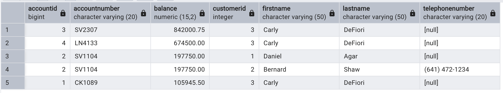
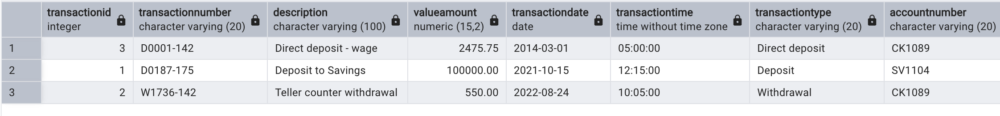

# APSD

## Singal Command to run the docker container and for migration:

### Task 3

```bash
chmod +x run_bank_db.sh

./run_bank_db.sh
```

---

`PostgreSQL will be accessible on`

```bash
localhost:5432
```

`PGAdmin will be accessible at`

```bash
http://localhost:8080
```

## Setup for the PG admin:

- First go to http://localhost:8080 and then enter the credentials:

  - Email: admin@bank.com
  - Password: bank_password

- Add New Server in PGAdmin:
  - Host: postgres
  - Port: 5432
  - Username: bank_user
  - Password: bank_password
  - Database: bank_db

---

---

### Task 1

## Domain Modeling:


### Task 2

## ER Diagram


### Task 4

## Now using the Query Tool

### SQL Queries in Action:

- `Display the list of ALL the Accounts registered in the banking system, sorted in
descending order of the Account Balances. Include the Customer data for each
Account. `

```sql
SELECT
    A.accountId,
    A.accountNumber,
    A.balance,
    C.customerId,
    C.firstName,
    C.lastName,
	C.telephonenumber
FROM Account A
JOIN Customer_Account CA ON A.accountId = CA.accountId
JOIN Customer C ON CA.customerId = C.customerId
ORDER BY A.balance DESC;
```



- `Display the list of ALL Transactions with a Value Amount greater than 500.00.
Include in the result, the Account Numbers. And sort the list in ascending order
of the Tansaction Date and Time. `

```sql
SELECT
    T.transactionId,
    T.transactionNumber,
    T.description,
    T.valueAmount,
    T.transactionDate,
    T.transactionTime,
    T.transactionType,
    A.accountNumber
FROM Transaction T
JOIN Account A ON T.accountId = A.accountId
WHERE T.valueAmount > 500.00
ORDER BY T.transactionDate ASC, T.transactionTime ASC;
```


