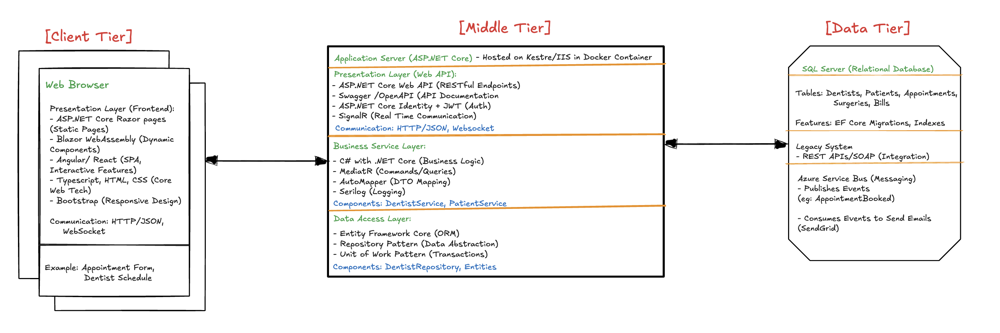
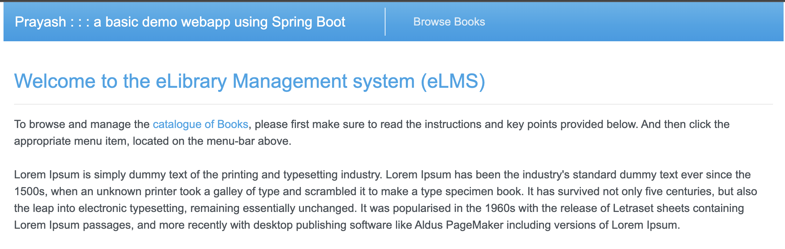
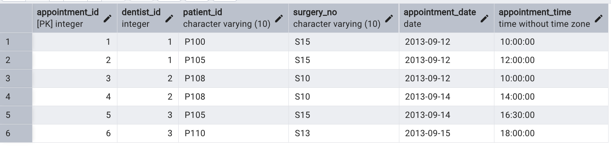
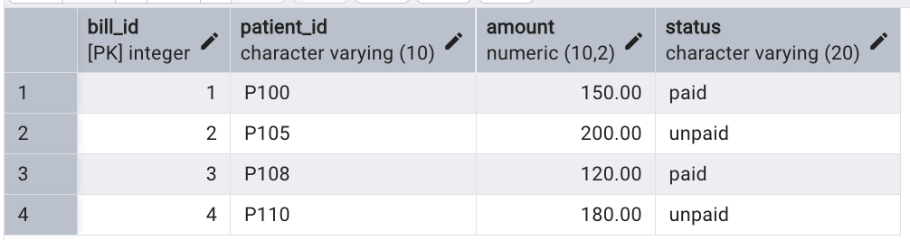
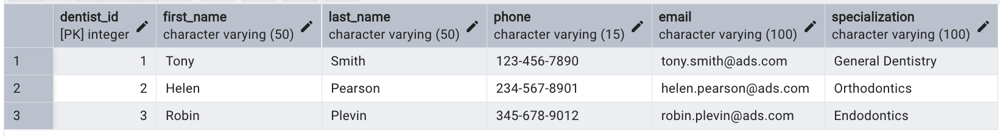
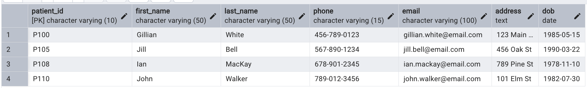
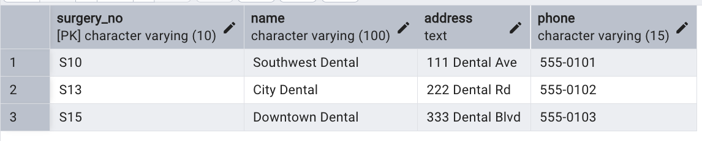
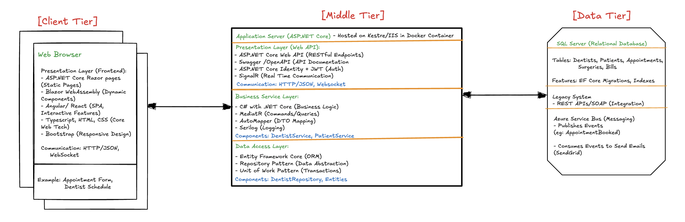
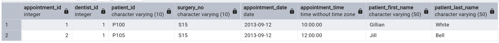
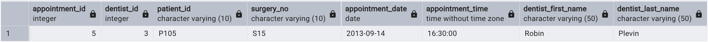

# APSD

## Singal Command to run the docker container and for migration:

```bash
chmod +x run_ads_db.sh

./run_ads_db.sh
```

---

`PostgreSQL will be accessible on`

```bash
localhost:5432
```

`PGAdmin will be accessible at`

```bash
http://localhost:8080
```

## Setup for the PG admin:

- First go to http://localhost:8080 and then enter the credentials:
  - Email: admin@ads.com
  - Password: admin_password
    
    
- Add New Server in PGAdmin:
  - Host: postgres
  - Port: 5432
  - Username: ads_user
  - Password: ads_password
  - Database: ads_dental_db

---

---

Tables:
Appointment table:


Bill Table:


Dentist Table:


Patient Table:


Surgery:


## Now using the Query Tool

### SQL Queries in Action:

- `Display the list of ALL Dentists registered in the system, sorted in ascending
order of their lastNames`

```sql
SELECT * FROM Dentist ORDER BY last_name ASC;
```



- `Display the list of ALL Appointments for a given Dentist by their dentist_Id
number. Include in the result, the Patient information.`

```sql
SELECT a.*, p.first_name AS patient_first_name, p.last_name AS patient_last_name
FROM Appointment a
JOIN Patient p ON a.patient_id = p.patient_id
WHERE a.dentist_id = 1;
```



- `Display the list of ALL Appointments that have been scheduled at a Surgery
Location` (for this I'm using S15)

```sql
SELECT a.*, d.first_name AS dentist_first_name, d.last_name AS dentist_last_name, p.first_name AS patient_first_name, p.last_name AS patient_last_name
FROM Appointment a
JOIN Dentist d ON a.dentist_id = d.dentist_id
JOIN Patient p ON a.patient_id = p.patient_id
WHERE a.surgery_no = 'S15';
```

- `Display the list of the Appointments booked for a given Patient on a given Date.`

```sql
SELECT a.*, d.first_name AS dentist_first_name, d.last_name AS dentist_last_name
FROM Appointment a
JOIN Dentist d ON a.dentist_id = d.dentist_id
WHERE a.patient_id = 'P105' AND a.appointment_date = '2013-09-14';
```


